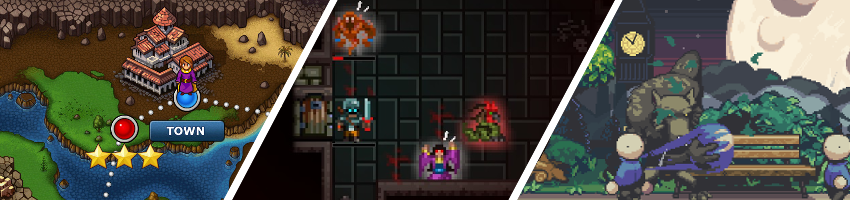

[flixel](https://github.com/HaxeFlixel/flixel) | [eklentiler](https://github.com/HaxeFlixel/flixel-addons) | [ui](https://github.com/HaxeFlixel/flixel-ui) | [demolar](https://github.com/HaxeFlixel/flixel-demos) | [araçlar](https://github.com/HaxeFlixel/flixel-tools) | [şablonlar](https://github.com/HaxeFlixel/flixel-templates) | [dökümanlar](https://github.com/HaxeFlixel/flixel-docs) | [haxeflixel.com](https://github.com/HaxeFlixel/haxeflixel.com) | [english](https://github.com/HaxeFlixel/flixel/blob/dev/README.md)

 

## Bağlantılar

Burada HaxeFlixel ile başlayabilmeniz için bazı önemli bağlantılar var:

- [Başlarken](https://haxeflixel.com/documentation/getting-started/)
- [Dökümantasyon](https://haxeflixel.com/documentation)
- [API](https://api.haxeflixel.com/)
- [Topluluk](https://haxeflixel.com/documentation/community/)

Eğer kod katkısında bulunmak veya hata bildirmek istiyorsanız, lütfen [CONTRIBUTING.md](https://github.com/HaxeFlixel/flixel/blob/dev/.github/CONTRIBUTING_TR.md)'mizi inceleyin.

## Platformlar

[Haxe](https://haxe.org/) ve [OpenFL](http://www.openfl.org/) üzerinde yapılması sayesinde, HaxeFlixel _doğal olarak_ aşağıdaki platformları destekler:

## Hakkında

HaxeFlixel, [Adam “Atomic” Saltsman](http://www.adamatomic.com/) tarafından yapılan [Flixel'in ActionScript3 versiyonu](https://github.com/AdamAtomic/flixel) ndan köklerini almaktadır. 2011'de [Alexander Hohlov](https://github.com/beeblerox) tarafından AS3 kod tabanının ve Richard Davey'in [Flixel Güç Araçları](http://www.photonstorm.com/flixel-power-tools) nın Haxe portu olarak başladı.

HaxeFlixel'in bugünkü sürümü, [çekirdek ekibin](https://github.com/orgs/HaxeFlixel/people) ve [100'ün üzerinde katkıda bulunanları](https://github.com/HaxeFlixel/flixel/graphs/contributors) sayesinde bugünkü halini aldı. Yalnızca çekirdek motorunda değil birçok önemli gelişme ve yeni özellik görmenin yanı sıra, daha zengin bir ekosistem de ek kütüphanelerle ve [80'den fazla demo projesiyle](https://github.com/HaxeFlixel/flixel-demos) öğrenmeye olanak sağlamaktadır.
