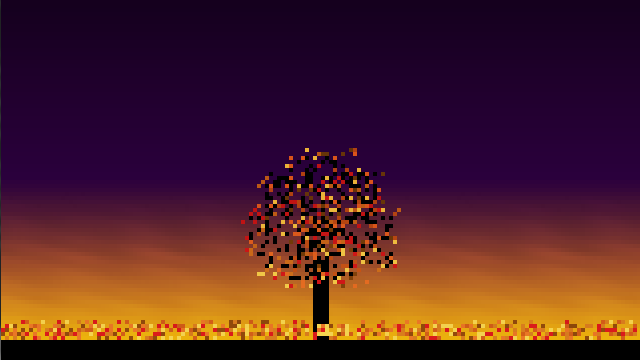

#  Fall

Based on the original [Fall demo](https://github.com/SeiferTim/Flixel-Showcase--Fall) by [SeiferTim](https://github.com/SeiferTim) (which you can see [here](http://www.tims-world.com/exp.php#)), updated for the latest [HaxeFlixel](https://github.com/haxeflixel) release.

	
Fall is a demonstration of a variety of effects and methods, such as:
* Procedural content generation
* Use of FlxTypedGroup
* Large numbers of objects on-screen simultaneously
* Basic physics
* FlxGradient use

Changes from the original:
* Use of FlxGradient to generate background image
* Use of FlxTypedGroups
* Use of FlxRandom
* Widescreen resolution
* More efficient collision code