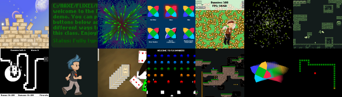

[flixel](https://github.com/HaxeFlixel/flixel) | [addons](https://github.com/HaxeFlixel/flixel-addons) | [ui](https://github.com/HaxeFlixel/flixel-ui) | [demos](https://github.com/HaxeFlixel/flixel-demos) | [tools](https://github.com/HaxeFlixel/flixel-tools) | [templates](https://github.com/HaxeFlixel/flixel-templates) | [docs](https://github.com/HaxeFlixel/flixel-docs) | [haxeflixel.com](https://github.com/HaxeFlixel/haxeflixel.com)

[](http://lib.haxe.org/p/flixel-demos)
[](https://travis-ci.org/HaxeFlixel/flixel-demos)

## About

This is a collection of **75+ demos** using the HaxeFlixel engine and demonstrating its capabilities. All the ones that are compatible with flash can be found on [haxeflixel.com/demos](http://haxeflixel.com/demos/).



## Installation

To get the master branch / the release compatible with the latest flixel release, run:

`haxelib install flixel-demos`

You can then use [flixel-tools](https://github.com/HaxeFlixel/flixel-tools) `create` command to create one of the demos in a directory of your choice, or alternatively run them directly from the haxelib directory.

## For Developers

If you are wanting to contribute code, please review the follwing documentation:

- [Code Contributions](http://haxeflixel.com/documentation/code-contributions)
- [Code Style](http://haxeflixel.com/documentation/code-style)
- [Install development flixel](http://haxeflixel.com/documentation/install-development-flixel/)

If you have a question or have not contributed on github before, there are friendly people in the community that help out in the [forums](http://haxeflixel.com/documentation/community/).

For using Git with GitHub we recommended using a GUI application to manage your changes, for example [SourceTree](http://www.sourcetreeapp.com/).

If you want to use Visual Studio Code with flixel-demos, you can use [flixel-tools](https://github.com/HaxeFlixel/flixel-tools) to create `.vscode` directories for all projects at once:

```
flixel configure <path-to-flixel-demos> -ide vscode
```

If you installed flixel-demos via `haxelib git` on Windows, the path will be `C:\HaxeToolkit\haxe\lib\flixel-demos\git`.
