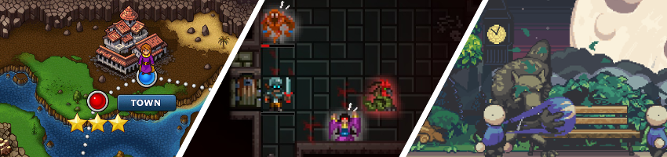

[flixel](https://github.com/HaxeFlixel/flixel) | [addons](https://github.com/HaxeFlixel/flixel-addons) | [ui](https://github.com/HaxeFlixel/flixel-ui) | [demos](https://github.com/HaxeFlixel/flixel-demos) | [tools](https://github.com/HaxeFlixel/flixel-tools) | [templates](https://github.com/HaxeFlixel/flixel-templates) | [docs](https://github.com/HaxeFlixel/flixel-docs) | [haxeflixel.com](https://github.com/HaxeFlixel/haxeflixel.com)

 

## Links

Here are the most important links to get you started with HaxeFlixel:

- [Getting Started](https://haxeflixel.com/documentation/getting-started/)
- [Documentation](https://haxeflixel.com/documentation)
- [API](https://api.haxeflixel.com/)
- [Community](https://haxeflixel.com/documentation/community/)

If you want to contribute code or report an issue, please check our [CONTRIBUTING.md](https://github.com/HaxeFlixel/flixel/blob/dev/.github/CONTRIBUTING.md).

## Platforms

Thanks to being built on top of [Haxe](https://haxe.org/) and [OpenFL](http://www.openfl.org/), HaxeFlixel can target the following platforms _natively_:

## About

HaxeFlixel has its roots in the original [ActionScript 3 version of Flixel](https://github.com/AdamAtomic/flixel), created by [Adam “Atomic” Saltsman](http://www.adamatomic.com/). It was started by [Alexander Hohlov](https://github.com/beeblerox) in 2011, initially as a straightforward Haxe port of the AS3 codebase and Richard Davey's [Flixel Power Tools](http://www.photonstorm.com/flixel-power-tools).

Thanks to the efforts of the [core team](https://github.com/orgs/HaxeFlixel/people) as well as [over 100 contributors](https://github.com/HaxeFlixel/flixel/graphs/contributors), today's version of HaxeFlixel far surpasses the capabilities of the original. Not only has the core engine seen many substantial improvements and new features, there is also a far richer ecosystem with additional libaries and [over 80 demo projects](https://github.com/HaxeFlixel/flixel-demos) to learn from.
