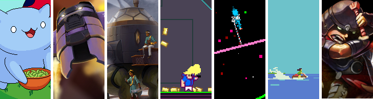

[flixel](https://github.com/HaxeFlixel/flixel) | [addons](https://github.com/HaxeFlixel/flixel-addons) | [ui](https://github.com/HaxeFlixel/flixel-ui) | [demos](https://github.com/HaxeFlixel/flixel-demos) | [tools](https://github.com/HaxeFlixel/flixel-tools) | [templates](https://github.com/HaxeFlixel/flixel-templates) | [docs](https://github.com/HaxeFlixel/flixel-docs) | [haxeflixel.com](https://github.com/HaxeFlixel/haxeflixel.com)

 

##Getting Started

[Click here to get started making games with HaxeFlixel.](http://haxeflixel.com/documentation/getting-started/)

HaxeFlixel is open source software developed by volunteers, [click here to meet the team!](https://github.com/orgs/HaxeFlixel/people)

If you're a developer and like what we're doing, [read the docs](#for-developers) and get involved.

##Links

In case you're looking for resources, help, or just want to interact with the community:

- [HaxeFlixel.com](http://www.haxeflixel.com/)
  - [Forums](http://www.haxeflixel.com/forum)
  - [Docs](http://www.haxeflixel.com/documentation)
  - [API](http://api.haxeflixel.com/)
- [@HaxeFlixel on Twitter](https://twitter.com/HaxeFlixel)
- [#haxeflixel IRC channel](http://webchat.freenode.net/?channels=haxeflixel)

##About

HaxeFlixel was created by Alexander Hohlov, also known as [Beeblerox](https://github.com/beeblerox) who continues to be the project lead. The codebase started largely from a Haxe port of the [AS3 version of Flixel](https://github.com/AdamAtomic/flixel) written by [Adam “Atomic” Saltsman](http://www.adamatomic.com/) and [Richard Davey's](http://www.photonstorm.com/flixel-power-tools) [Power Tools](https://github.com/photonstorm/Flixel-Power-Tools)

Special thanks go to the community contributors [Werdn](https://github.com/werdn), [gamedevsam](https://github.com/gamedevsam), [impaler](https://github.com/impaler), [ProG4mr](https://github.com/ProG4mr), [Gama11](https://github.com/Gama11), [sergey-miryanov](https://github.com/sergey-miryanov) and more.

HaxeFlixel presents substantial enhancements from the original Flixel AS3 code:

- Use of a robust and powerful, open source language
- Flexible Asset Management System
- Cross-platform development for Linux, Mac and Windows
- Texture Atlas and Layer enhancement for cpp targets
- Integrated and robust Tween System
- Access to OpenFL native extensions
- Compile to Mobile and Desktop targets with native code through OpenFL
- Impressive Native Performance using GPU accelerated drawTiles implementation on cpp targets
- A powerful debugger with a console as well as an advanced logging system
- A vibrant community that keeps updating the engine and adding new features to it

##For Developers

If you are wanting to contribute code, please review the following documentation:

- [Install development flixel](http://haxeflixel.com/documentation/install-development-flixel/)
- [Code Contributions](http://haxeflixel.com/documentation/code-contributions)
- [Code Style](http://haxeflixel.com/documentation/code-style)

If you have a question or have not contributed on GitHub before, there are friendly people in the community that help out in the [forums](http://haxeflixel.com/documentation/community/).

For using git with GitHub we recommended using a GUI application to manage your changes, for example [SourceTree](http://www.sourcetreeapp.com/).

##Runtime Targets
The current possible targets are:

<table>
  <tr>
    <th>Mobile</th>
    <th>Desktop</th>
    <th>Web</th>
  </tr>
  <tr>
    <td>Blackberry</td>
    <td>Linux</td>
    <td>Flash</td>
  </tr>
  <tr>
    <td>iOS</td>
    <td>Mac</td>
    <td></td>
  </tr>
  <tr>
    <td>Android</td>
    <td>Windows</td>
    <td></td>
  </tr>
  <tr>
    <td>WebOS</td>
    <td>Neko</td>
    <td></td>
  </tr>
</table>

There's also experimental support for HTML5.

##Basic Features

- Display thousands of moving objects
- Basic collisions between objects
- Group objects together for simplicity
- Easily generate and emit particles
- Create game levels using tilemaps
- Text display, save games, scrolling
- Mouse, keyboard, controller, and touch inputs
- Math & color utilities
- Record and play back replays
- Powerful interactive debugger
- Camera system for split screen
- Pathfinding and following
- Easy object recycling
